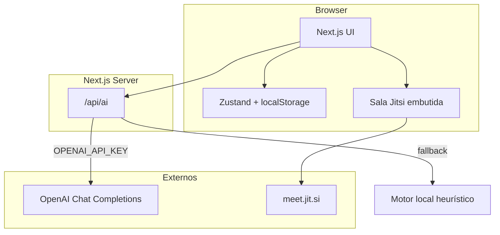

# Arquitetura — TrelloAI

## Contexto

## Componentes

| Componente | Responsabilidade | Tecnologia |
|------------|------------------|------------|
| UI Kanban | Boards, listas, cards, DnD | React + @dnd-kit |
| Store | Estado e persistência | Zustand persist |
| API IA | Interpreta prompt e devolve ações | Next.js Route Handler |
| Motor local | Fallback sem chave | Heurísticas PT-BR |
| Equipe & reuniões | Membros, agenda, salas | Zustand + Jitsi iframe |

## Modelo de dados (cliente)

- `Board` → `listIds[]`, `memberIds[]`
- `List` → `cardIds[]`
- `Card` → título, descrição, labels, prioridade, dueDate
- `TeamMember` → nome, email, role
- `Meeting` → sala Jitsi (`roomSlug`), status, agenda, participantes

## Decisões

- **ADR-001**: Persistência em `localStorage` no MVP — simples e offline-first.
- **ADR-002**: Ações de IA estruturadas (`create_cards`, `suggest_priorities`) aplicadas no client.
- **ADR-003**: OpenAI opcional; produto usable sem chave.
- **ADR-004**: Reuniões via Jitsi público (`meet.jit.si`) — sem API key; link compartilhável com a equipe.

## Próxima evolução

Auth + Postgres + sync multi-dispositivo; realtime via WebSockets.
