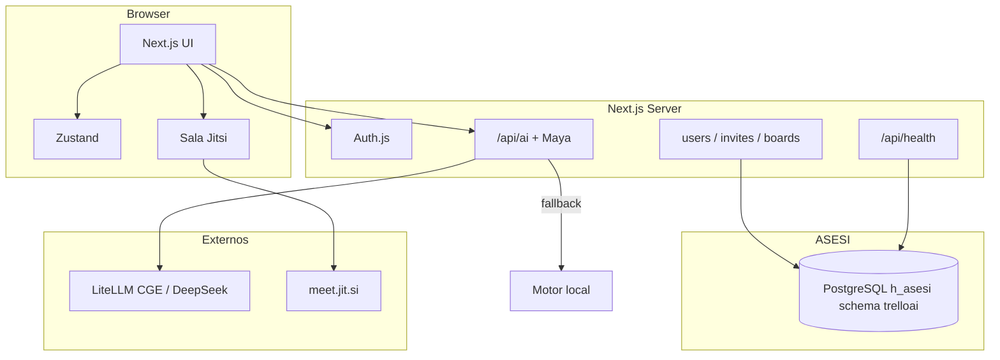

# Arquitetura — Jangada

## Contexto

## Componentes

| Componente | Responsabilidade | Tecnologia |
|------------|------------------|------------|
| UI Kanban | Boards, listas, cards, DnD | React + @dnd-kit |
| Marca | Jangada + paleta Ceará | BrandMark, Kanit / DM Sans |
| Auth | Login e-mail/senha; Google opcional | Auth.js |
| Persistência | Boards, membros, usuários, convites | PostgreSQL `trelloai` |
| Maya | Daily, criar/mover cards, prioridades | DeepSeek / LiteLLM |
| Motor local | Fallback sem chave LLM | Heurísticas PT-BR |
| Equipe e reuniões | Membros, agenda, salas | Zustand + Jitsi iframe |

## Modelo de dados

- `Board` → `listIds[]`, `memberIds[]`
- `List` → `cardIds[]`
- `Card` → título, descrição, labels, prioridade, dueDate
- `TeamMember` → nome, email, role
- `Meeting` → sala Jitsi (`roomSlug`), status, agenda, participantes
- Schema SQL: `infra/asesi-schema.sql`

## Decisões

- **ADR-001**: `localStorage` / arquivos em `data/` só como fallback sem `PG_*`.
- **ADR-005**: Persistência compartilhada no PostgreSQL ASESI (`h_asesi`, schema `trelloai`), isolado do schema `farol`.
- **ADR-002**: Ações de IA estruturadas (`create_cards`, `suggest_priorities`) aplicadas no client.
- **ADR-003**: LLM opcional; produto usable sem chave (motor local).
- **ADR-004**: Reuniões via Jitsi público (`meet.jit.si`).
- **ADR-006**: Homologação no padrão ASESI (Swarm, Traefik, Nexus, branch `homol`).
